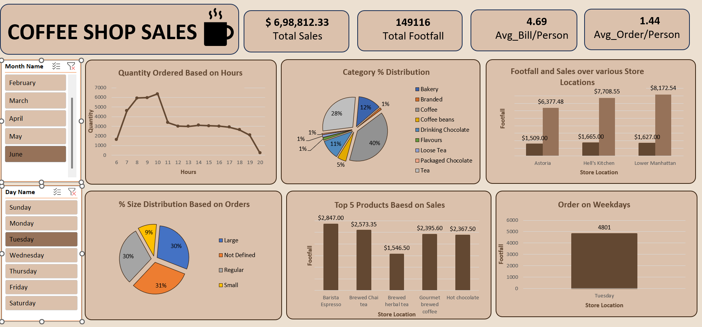

# ☕ Coffee Shop Sales Analysis

## 📊 Excel Dashboard

## 📌 Project Overview

This project analyzes coffee shop sales data using Microsoft Excel to identify sales trends, customer footfall, product performance, category distribution, and order patterns.

## 🛠️ Tools & Technologies

- Microsoft Excel
- Pivot Tables
- Pivot Charts
- Slicers
- Data Cleaning
- Data Analysis
- Dashboard Design

## 📈 Dashboard KPIs

- Total Sales
- Total Footfall
- Average Bill per Person
- Average Order per Person

## 📊 Analysis Performed

- Quantity ordered based on hours
- Category-wise sales distribution
- Footfall and sales by store location
- Order size distribution
- Top 5 products based on sales
- Orders on weekdays
- Monthly and daily filtering

## 💡 Key Insights

The dashboard provides an interactive view of coffee shop sales performance and helps identify high-performing products, sales patterns by hour, customer footfall, and category-level contribution.
